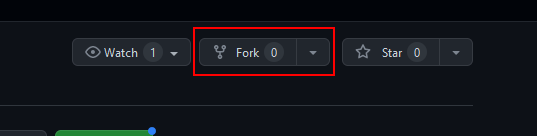
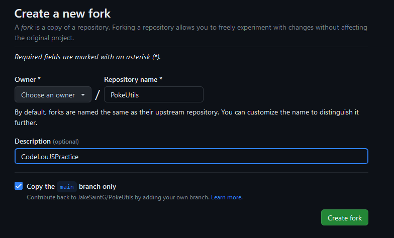

# What Can JavaScript Do For You?
## _An Exercise for Code Louisville_

### Get Started
1. Fork
    - "Forking" a repo will create a copy of it on your own GitHub profile.
    - There is a loose connection back to the home repo but we can cover that later.
    - To create a fork, __make sure you are signed in__ and click the "fork" button in the upper left.
      - 
    - Finalize the fork and click "Create fork".
      - 
2. Clone
    - Find an ideal folder on your machine and clone YOUR version of this repo that you just made under your Github.
        ```sh
        git clone https://github.com/{{YOUR_USERNAME}}/CodeLouJSPractice.git
        ```
3. Live Server
    - We highly recommend that you use Live Server to view the rendered project. Its a valuable VSCode extension!
    - [Download](https://marketplace.visualstudio.com/items?itemName=ritwickdey.LiveServer)
4. Explore!
    - Look around the project! Tweak stuff, break stuff, view in the debugger, etc.
    - Please reach out to your mentors if you have any questions about what you see!

### Contents
- Alert
  - An incrementing notification/alert.
  - Check out some of the stying here!
- Loading...
  - A dynamic "loading" bar that reacts to a slider.
  - This is an exercise in assigning some styling using JavaScript.
- Dynamic Text
  - A text box that will display the input in "real time" through an H1.
  - See if you can improve it!
- 🍔 Menu
  - A basic example of a hambuger style menu using JavaScript. 
- Retro-ify
  - Turning an image different colors using a combination of JavaScript and CSS. 
- Append!
  - Build your Pikmin army using this exercise in HTML ids and how they can be used in JavaScript. 

### Disclaimers
- This project deviates slightly from the folder/file layout we discussed in class. This project has a more "component" approach to keep it organized for demonstration purposes.
- Some of the element styling can be a little complex! Please ask your mentors if you have any questions.
  - Note: For simplicity, not everything has a great deal of styling put into it. 